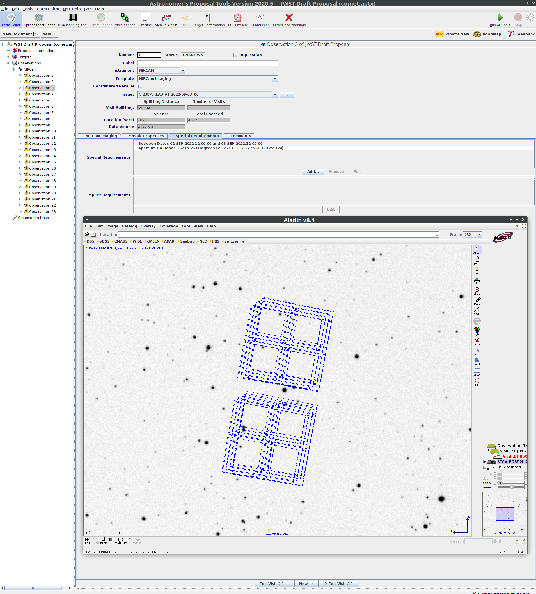

# jwst-comets
Tools, tips, tricks for designing comet observations with JWST

## Tips
### Power-law profile

Cometary comae have surface brightness profiles that tend to follow a radial power-law.  The ideal coma is proportional to 1/ρ, where ρ is the distance to the nucleus.  The JWST ETC has a power-law surface brightness profile.  The central core of that profile is flat, then it follows 1/ρ thereafter.  This can be used for comets, but with caution.  In order to faithfully reproduce a cometary scene, the central core must be smaller than the pixel size of the instrument in question.

Based on the script `etc-profile-test.py` and the notebook `notes/etc-profile-notes.py`, I recommend the following:
* Generate the surface brightness of a coma averaged over an aperture of radius of 2 mas in units of mJy/arcsec^2.
* Upload this spectrum to the JWST ETC.
* Create a new source, using this spectrum as the continuum.
* Set "Do not renormalize" under the Renorm tab.
* Set the shape to "Power law":
  - normalize to per square arcsec
  - core radius to 0.001 arcsec (= 1 mas)
  - power law index to 1

There is a difference of a factor of 2 between the core radius and the aperture radius used in the coma flux estimation tool.  This difference sets the correct normalization for the ETC coma surface brightness.

## Brightness estimates
### jwst-comet-est.py

---
**Warning**

* Conversions from total visual magnitude to dust Afρ is experimental.

* Gas output is not yet implemented.

---


```
usage: jwst-comet-est.py [-h] [--aper APER] [-R R] [--unit UNIT] [-m]
                         [--dusty] [--gassy] (--afrho AFRHO | -Q Q)
                         [--ef2af EF2AF] [--Tscale TSCALE] [--h2o H2O]
                         [--co2 CO2] [--co CO] [-o O]
                         rh delta

Generate model comet spectra for JWST ETC.

positional arguments:
  rh               heliocentric distance (au)
  delta            observer-target distance (au)

optional arguments:
  -h, --help       show this help message and exit
  --aper APER      aperture radius (arcsec), or one of: ifu, fs200, fs400,
                   fs1600, lrs, mrs, nircam (default: 0.2 arcsec)
  -R R             spectral resolution (default: 10)
  --unit UNIT      output spectral flux density or surface brightness unit
                   (default: mJy/arcsec2)
  -m               indicates that --afrho or -Q is a total visual mangitude
                   that should be converted before using (default: False)
  --dusty, -d      indicates that the conversion from -m should assume a dusty
                   coma, repeated options increase dust/gas: Q/1.6|2.4|3.7,
                   Afrho*4.8|23|110 (default: 0)
  --gassy, -g      indicates that the conversion from -m should assume a gassy
                   coma, repeated options increase gas/dust: Q*1.6|2.4|3.7,
                   Afrho/4.8|23|110 (default: 0)
  --afrho AFRHO    dust mode based on this Afρ at 0 deg phase (cm) or total
                   visual magnitude (requires -m) (default: None)
  -Q Q             gas mode based on this scale factor (molecules/s) or total
                   visual magnitude (requires -m) (default: None)
  -o O             save to this file name (default: None)

dust options:
  --ef2af EF2AF    the ratio εfρ/Afρ (default: 3.5)
  --Tscale TSCALE  LTE blackbody temperature scale factor (default: 1.1)

gas options:
  --h2o H2O        relative H2O production rate (default: 1.0)
  --co2 CO2        relative CO2 production rate (default: 0.15)
  --co CO          relative CO production rate (default: 0.05)

For gas output, -m uses the Jorda et al. (2008, ACM, 8046) correlation
Q=10**(30.675 - 0.2453 * mH), where mH is heliocentric magnitude. This assumes
--h2o=1.0. --gassy and --dusty can be repeatedly used to scale the results.
```

Generate a spectrum for a comet with Afρ=100 cm at rh=1.5 au, and Δ=1.0 au, as observed by MIRI LRS:
```
$ python3 jwst-comet-est.py 1.5 1.0 --afrho=100 --aper=lrs --unit=mJy
# %ECSV 0.9
# ---
# datatype:
# - {name: wave, unit: um, datatype: float64}
# - {name: total, unit: mJy, datatype: float64}
# - {name: F_sca, unit: mJy, datatype: float64}
# - {name: F_th, unit: mJy, datatype: float64}
# meta: !!omap
# - {cmd: estimations/jwst-comet-est.py 1.5 1.0 --afrho=100 --aper=lrs --unit=mJy}
# - {rh: 1.5 AU}
# - {delta: 1.0 AU}
# - {phase: 41.40962210927086 deg}
# - {aper: "Rectangular aperture, dimensions 0.5\xD71.6 arcsec"}
# - phase function: !numpy.ndarray
#     buffer: !!binary |
#       aUZRdnJlZjgxajg9
#     dtype: float64
#     order: C
#     shape: !!python/tuple [1]
# - {ef2af: 3.5}
# - {Tscale: 1.1}
# - {Afrho: 100.0 cm}
# - {efrho: 350.0 cm}
# schema: astropy-2.0
wave total F_sca F_th
0.5 0.09409975009087415 0.09409975009087415 1.088440633433928e-41
0.55 0.110780768520771 0.110780768520771 1.93395762848993e-37
...
```

## APT fixed moving targets

As of May 2021, APT does not visualize moving targets. Instead, fixed targets may be used as a work around. The best fixed targets use the ephemeris of the moving target in question. To that end, the script `apt-fixed-moving-target.py` (in the `apt-targets` directory) generates a set of fixed targets centered on the object ephemeris.  You specify the date range and step size.  Only times when the target is observable by JWST are returned.


### Requirements
* Python 3
* astropy
* astroquery

### Usage
This is a command-line Python script.  A brief help may be displayed:

```
$ python3 apt-fixed-moving-target.py -h
usage: apt-fixed-moving-target [-h] [--type {comet,designation,smallbody,majorbody}] [--step STEP] [-o O] [-f] [--xml] [--nircam] [--no-cache] target start_date stop_date

Generate fixed targets for JWST APT based on moving target ephemerides.

positional arguments:
  target                moving target, e.g., 1P, 24, P/2003 S2
  start_date            UTC start date, YYYY-MM-DD
  stop_date             UTC stop date, YYYY-MM-DD

optional arguments:
  -h, --help            show this help message and exit
  --type {comet,designation,smallbody,majorbody}
                        target type
  --step STEP           Step size, e.g., 5d
  -o O                  output to this file name
  -f                    force overwrite output file
  --xml                 format output as APT XML
  --nircam              observe with NIRCam (for XML output)
  --no-cache            do not use cached ephemeris

Target names must be resolvable by JPL Horizons. Specifying --type=comet will use the "closest apparition" and "no fragment" search flags.
```

There are two output modes: a plain text target list, and a JWST XML APT file.
* The plain text target list can be imported into APT and each fixed target
assigned to whatever observations you want.
* The XML file can optionally include some dummy NIRCam observations,
one for each ephemeris epoch.  The observations have position angle
constraints, so that when they are viewed with APT, they already have
the approximate (to the best of my knowledge) orientation for that
ephemeris epoch.

### Examples
#### Plain text table output
A plain text table of targets can be generated.  This list helps identify the time periods an object is observable, and the position in the sky when it is observable.  It does not help understand the orientation of the instruments at those times.

Generate fixed targets for comet 238P, output as space-separated-value table
```
$ python3 apt-fixed-moving-target.py 116P 2022-05-01 2022-07-01 --type=comet -o comet.txt
$ cat comet.txt
# Name RA DEC "RA Uncertainty" "Dec Uncertainty" Comments
116P.Wild.4.at.2022-05-01T00 144.61541 16.73492 2.456 0.968 "2022-05-01 00:00:00.000 UTC, rh: 2.262 au, delta: 1.83 au, phase: 26.18 deg, target->Sun PA: 290 deg, velocity PA: 291 deg"
116P.Wild.4.at.2022-05-06T00 145.78329 16.14966 2.397 0.965 "2022-05-06 00:00:00.000 UTC, rh: 2.254 au, delta: 1.88 au, phase: 26.61 deg, target->Sun PA: 290 deg, velocity PA: 292 deg"
116P.Wild.4.at.2022-05-11T00 147.0766 15.5206 2.342 0.963 "2022-05-11 00:00:00.000 UTC, rh: 2.247 au, delta: 1.93 au, phase: 26.91 deg, target->Sun PA: 290 deg, velocity PA: 292 deg"
116P.Wild.4.at.2022-05-16T00 148.48423 14.84954 2.291 0.963 "2022-05-16 00:00:00.000 UTC, rh: 2.240 au, delta: 1.98 au, phase: 27.10 deg, target->Sun PA: 290 deg, velocity PA: 293 deg"
116P.Wild.4.at.2022-05-21T00 149.99567 14.13821 2.245 0.965 "2022-05-21 00:00:00.000 UTC, rh: 2.233 au, delta: 2.03 au, phase: 27.19 deg, target->Sun PA: 290 deg, velocity PA: 293 deg"
```

Same, but for an asteroid and a planet:
```
$ python3 apt-fixed-moving-target.py 24 2022-05-01 2023-05-01 -o asteroid.txt
$ python3 apt-fixed-moving-target.py 599 2022-05-01 2023-05-01 --type=majorbody -o planet.txt
```

See JDOX for instructions on how to [read these target lists](https://jwst-docs.stsci.edu/jwst-astronomers-proposal-tool-overview/apt-workflow-articles/apt-bulk-target-ingest#APTBulkTargetIngest-AccessingtheImporter) into APT.

#### XML output and generated observations
Use `--xml` to generate an APT file in XML format, which can be imported into APT (File->Import->JWST XML file).

Templated observations of your target may also be generated for NIRCam using `--nircam`.  The observations will have position angle and timing constraints based on the target-Sun angle and ephemeris epoch.  With the position angle constraint, the Aladin viewer will automatically give NIRCam the approximate orientation.  These constraints should not be used for designing real observations.

---
**Warning**

The orientations are based on the target-Sun angle, which, to the best of my knowledge, is correct.  However, please verify the orientation yourself and let me know of any successes or failures.

---

```
python3 apt-fixed-moving-target.py 116P 2022-05-01 2022-07-01 --type=comet --xml --nircam -o comet.xml
```
