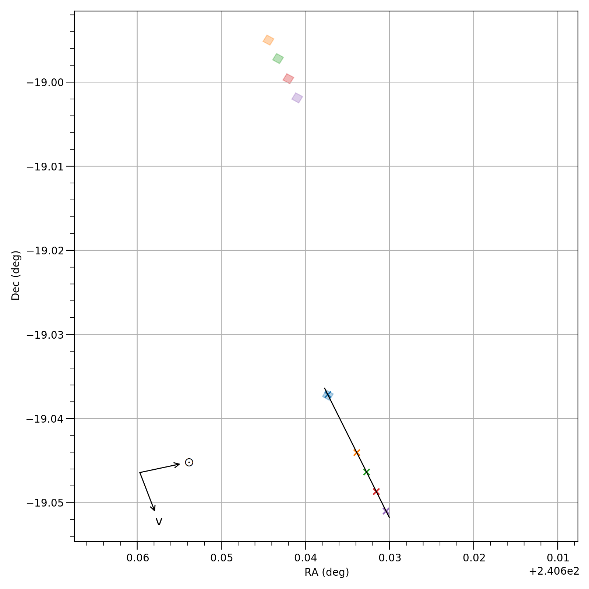

## Instrument Fields of View

Plot the fields of view of JWST data products with respect to the position of a moving target.  The data polygons are found in the FITS file headers under the S_REGION keyword.  In the resulting plots, the boxes are the fields-of-view of the data, and the exes with the matching colors are the positions of the comet.  In other words, pair the blue box with the blue "x".

Author: Michael S. P. Kelley

## Requirements
* Python 3
* astropy
* astroquery
* spherical_geometry
* matplotlib

## Usage
This is a command-line Python script.  A brief help may be displayed:

```
$ python3 jwst-data-fov.py -h
usage: jwst-data-fov.py [-h] [--target TARGET] [--id-type {comet,designation,smallbody,majorbody}] [--no-cache] [-o O]
                        files [files ...]

positional arguments:
  files                 JWST data in FITS format, S_REGION keyword is required

optional arguments:
  -h, --help            show this help message and exit
  --target TARGET, -t TARGET
                        target comet or asteroid name, must be resolvable by JPL Horizons
  --id-type {comet,designation,smallbody,majorbody}
                        target ID type (use comet to avoid matching multiple cometary orbits)
  --no-cache            do not use cached ephemeris when possible
  -o O                  save plot to this file
```

## Examples

```python
python3 jwst-data-fov.py data/jw0156601*_nrs1/*_rate.fits --target='C/2017 K2' -o c2017k2-nirspec-20220821-fov.png
```

One file is on-source and four files are offset for a background observation.